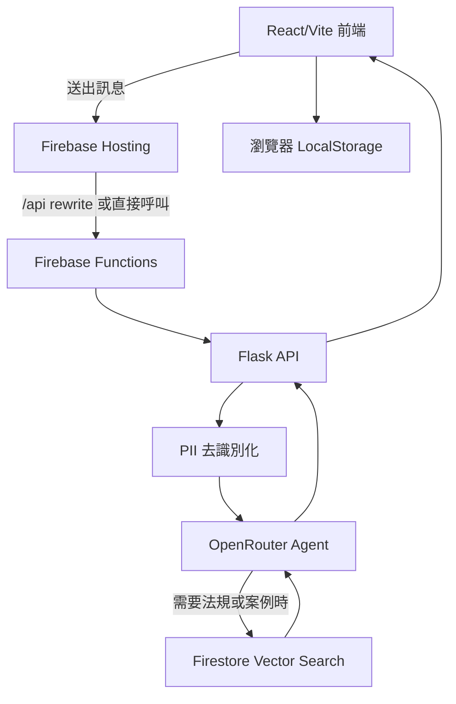

# 性騷擾防治智能 AI 助手

[](https://github.com/TWCkaijin/Anti-Harassment-Bot/actions/workflows/deploy-dev.yml)
[](https://github.com/TWCkaijin/Anti-Harassment-Bot/actions/workflows/deploy-main.yml)

性騷擾防治智能 AI 助手是一個面向台灣使用情境的諮詢與法規引導服務。系統以創傷知情的對話方式回應使用者，並透過 RAG 檢索台灣性騷擾防治相關法規、通報管道、救濟資源與判決資料，協助使用者取得更清楚、可行且具備隱私保護的初步資訊。

> 本專案僅提供資訊整理、同理支持與流程引導，不能取代律師、心理師、醫師、社工或正式申訴與報案程序。

## 部署狀態與網址

| Branch | CD Workflow | 部署環境 | 前端網址 | API URL |
| --- | --- | --- | --- | --- |
| `dev` | [Deploy - Preview](https://github.com/TWCkaijin/Anti-Harassment-Bot/actions/workflows/deploy-dev.yml) | Firebase Hosting Preview Channel | <https://anti-harassment-bot--dev-preview.web.app> | <https://asia-east1-anti-harassment-bot.cloudfunctions.net/api_preview> |
| `main` | [Deploy - Production](https://github.com/TWCkaijin/Anti-Harassment-Bot/actions/workflows/deploy-main.yml) | Firebase Hosting Production | <https://anti-harassment-bot.web.app> | <https://asia-east1-anti-harassment-bot.cloudfunctions.net/api> |

`dev` 分支部署至 Firebase Hosting preview channel，workflow 設定有效期限為 7 天；`main` 分支部署至正式 Firebase Hosting 網址。

## 核心功能

- 創傷知情對話：以溫和、不批判、避免責怪受害者的語氣提供支持與資訊。
- 隱私去識別化：後端在送出模型請求前，會先處理手機、身分證字號、Email、信用卡、IP 等常見個資格式。
- RAG 法規檢索：整合 Firestore Vector Search，檢索法規、救濟資源與性騷擾相關判決資料。
- 本地優先紀錄：對話紀錄保存在使用者瀏覽器 LocalStorage，後端 API 採無狀態設計。
- 前後端分離：前端使用 React + Vite + TypeScript；後端使用 Flask，並透過 Firebase Functions 對外提供 API。

## 系統架構



## 專案結構

```text
.
├── .github/workflows/       # CI 與 Firebase CD workflow
├── backend/                 # Flask API、Agent、RAG 與核心模組
│   ├── app/
│   │   ├── agents/          # OpenRouter agent
│   │   ├── api/             # chat / health API routes
│   │   ├── core/            # config、logger、anonymizer
│   │   └── rag/             # Firestore/default RAG implementation
│   └── scripts/             # Firestore ingestion scripts
├── data/                    # 法規、資源與判決資料
├── frontend/                # React + Vite + TypeScript 前端
├── scripts/                 # 資料轉換工具
├── tests/                   # pytest 測試
├── firebase.json            # Hosting 與 Functions 設定
├── main.py                  # Firebase Functions entrypoint
├── pyproject.toml           # Python dependency / pytest / ruff 設定
└── uv.lock                  # Python lockfile
```

## 本地開發

### 需求

- Python 3.13
- uv
- Node.js 24
- pnpm 9
- Firebase CLI

### 後端

```bash
cp .env.example .env
uv sync
uv run flask --app backend.app.main run --debug
```

後端預設會掛載：

- `GET /api/v1/health`
- `POST /api/v1/chat`
- `GET /v1/health`
- `POST /v1/chat`

### 前端

```bash
cd frontend
pnpm install
pnpm run dev
```

如需指定 API 位置，可在 `frontend/.env` 設定：

```bash
VITE_API_BASE_URL=http://127.0.0.1:5000
```

### 串流聊天 API

前端送出 `POST /v1/chat/` 時加入 `"stream": true`，使用 `fetch` 讀取 `text/event-stream`（SSE），AI 回覆文字會隨模型輸出逐段顯示。回覆文字的第一個可解碼片段立即交給 HTTP 串流，再讀取下一段，不等待全文或其他欄位。後續問題與建議選項也以 `guidance` 事件逐步顯示；生成中的選項暫不可操作，停止回覆仍可使用。完整回覆通過結構驗證、Actions 由已核准的 Skills 解析後，才套用情緒與來源並開放選單操作。一般下一步建議仍為水平按鈕，只有明確的 AI 追問才顯示詢問面板。

```bash
curl --no-buffer http://127.0.0.1:5000/v1/chat/ \
  -H 'Content-Type: application/json' \
  -H 'Accept: text/event-stream' \
  -d '{"message":"我想了解處理流程","history":[],"stream":true}'
```

每個 SSE event 的 `data` 是 JSON，空行分隔事件；`:` 開頭的連線／keep-alive 註解可忽略。

| Event | `data` 內容 | 前端行為 |
| --- | --- | --- |
| `progress` | `phase` 與 `elapsed_ms`；後者是伺服器從收到請求到該階段的實測毫秒數 | 依後端實際執行階段更新提示，不以固定秒數切換、不推估完成百分比 |
| `delta` | `{"text":"新增的回覆文字"}` | 將文字附加到同一則 AI 訊息 |
| `guidance` | 累積快照，可含 `interaction_mode`、`clarifying_questions`、`suggested_replies`；陣列最後一項可能尚未生成完畢 | 以整份快照更新問題與選項預覽，不附加重複文字；等 `done` 後才可點選 |
| `done` | 完整聊天回覆：`reply`、`session_id`、`anonymized`、`rag_used`、`emotion`、`emotion_color`、`suggested_replies`、`action_buttons`、`interaction_mode`、`clarifying_questions`；開發模式可另含 `debug_tool_calls` | 以驗證後的 `reply` 定稿，套用 metadata，結束串流 |
| `error` | `code`、`detail`、`retryable`、`status`；依錯誤可另含 `error_id`，非 production 的開發模式可另含 `debug_message` | 顯示錯誤並結束串流，不顯示未完成的選單 |

`progress.phase` 包含 `anonymizing`（啟用匿名化時）、`preparing`（準備模型輸入）、`waiting_model`（送出模型請求）、`retrieving`（實際呼叫資料檢索）、`generating`（已收到回覆文字）、`guidance`（已收到引導資料）、`validating`（檢查完整回覆）。只有實際執行的階段才會出現；沒有檢索就不顯示檢索提示，未收到新事件就維持目前狀態。首段回覆或引導內容優先送出，接著才補上對應狀態，不為進度提示延遲首字。`elapsed_ms` 是階段發生時間，並非完成比例或剩餘時間；不包含瀏覽器到伺服器的網路時間。

開始串流前的驗證、維護模式及存取限制錯誤仍回傳原本的 HTTP 狀態碼與 JSON。開始串流後 HTTP headers 已送出，錯誤以 `error` event 的 `status` 表達，並保留伺服器的 ERROR 日誌。已顯示回覆或引導文字時不自動重試，避免混入另一輪生成內容；發生錯誤或取消時移除尚未定稿的選單，未收到 `done` 的回覆視為未完成。不傳 `stream` 或設為 `false` 時，仍回傳相容的完整 JSON 回覆。

部署 workflow 已將 `VITE_API_BASE_URL` 指向各環境的 `cloudfunctions.net/api` 或 `api_preview`，串流請求直接送到 Functions，不經 Hosting 的 `/api/**` rewrite。Firebase wrapper 保留 WSGI 串流及關閉回呼，避免一次讀完回覆；關閉連線會清理上游生成工作。平台支援可參考 [Cloud Run HTTP/SSE streaming](https://cloud.google.com/blog/products/serverless/cloud-run-now-supports-http-grpc-server-streaming) 與 [Firebase Functions streaming response limits](https://firebase.google.com/docs/functions/quotas)。部署後可對上表的 API URL 執行同一個 `curl --no-buffer` 請求，確認首段 `delta` 在 `done` 之前抵達；本地測試無法代替部署環境的串流驗證。

#### 首字延遲診斷

`stream: true` 已涵蓋 OpenRouter 呼叫與 API → 瀏覽器的每一段。傳送的是模型產生的可見內容；JSON 結構、工具參數與 reasoning 不會顯示成回覆。RAG 回覆仍須先完成必要檢索；多個資料集合採並行查詢。程式不會以固定開場白冒充 first token，也不會覆寫後台設定的模型或推理強度。

應用程式以 INFO 記錄兩種不含聊天內容的計時事件（查詢時需包含 INFO）：

- `jsonPayload.event="openrouter_stream_timing"`：各模型呼叫的 `phase`、`first_upstream_chunk_ms`、`first_reply_delta_ms`、`duration_ms`，比較上游開始回傳到可見回覆的時間。
- `jsonPayload.event="chat_stream_timing"`：從 chat handler 開始計算的 `first_reply_ready_ms`、`first_reply_yield_ms`、`first_guidance_ready_ms`、`first_guidance_yield_ms`、`duration_ms`。ready 到 yield 的差距是應用程式轉交 WSGI 的延遲；不是使用者網路延遲或瀏覽器實際繪製時間。未到達的階段不會有欄位。

模型排隊、推理與檢索發生在可見文字之前，無法只靠串流完全消除；部署後應以計時日誌及瀏覽器 Network 的實際事件抵達時間確認。OpenRouter 的 TTFT 定義與排隊／prefill 因素見[官方延遲文件](https://openrouter.ai/docs/guides/best-practices/latency-and-performance)。

## 測試與檢查

```bash
uv run ruff check backend/ tests/
uv run ruff format --check backend/ tests/
uv run pytest tests/ -v
```

```bash
cd frontend
pnpm run lint
pnpm run build
```

## CI/CD

- `CI - Lint & Test`：所有 branch push 與 PR 都會執行後端 Ruff/pytest、前端 ESLint/Vitest coverage 與 build。
- `Deploy - Preview (dev)`：push 到 `dev` 時，必須先通過同一份 CI gate，再依變更範圍建置前端與/或部署 preview function。
- `Deploy - Production (main)`：只有變更合併並 push 到 `main`、通過 CI gate 後，才依變更範圍部署正式 Hosting 與/或 production function。PR 則只執行 `CI - Lint & Test`，不會部署 production。

## Runtime Admin Panel

前端側邊欄提供 `Admin` 入口，可在服務執行期間調整 runtime config。每個部署環境只有一份 Firestore runtime document；模型、RAG、開關與 Prompt Sections 都讀寫同一份文件。Admin API 使用 `ADMIN_API_KEY` 驗證，前端只會預填本機儲存的 token，仍須由後端驗證才能進入面板，且每次寫入都會帶上 token。

Runtime config 預設存放於：

- Collection：`runtime_config`
- dev Document：`app_dev`
- main Document：`app_main`

可調整欄位包含：

- `openrouter_model`
- `temperature`
- `top_p`
- `max_tokens`
- `development_mode`
- `agent_prompt_sections`
- `rag_retrieval_top_k`
- `rag_distance_threshold`（`0`–`2`，`null` 表示不套用門檻）
- `enable_anonymization`
- `enable_image_upload`
- `rag_collections.law`
- `rag_collections.judgment`
- `rag_collections.remedy`
- `maintenance_message`

Prompt Sections 儲存在同一份 Firestore document 的 `agent_prompt_sections` map。未設定的 section 只會使用程式碼內建的預設內容；不會再讀取 Firebase Remote Config、GitHub Actions Variables 或整份 legacy prompt。

`max_tokens` 設為 `0` 時，後端不會把 token 上限傳給 OpenRouter；其他正整數則會成為單次模型回覆的上限。`development_mode` 僅建議在 `app_dev` 開啟：它會在可重試的模型或 schema 錯誤中，額外回傳伺服器診斷字串給前端；當 `ENVIRONMENT=production` 時，後端會強制將它關閉。

`maintenance_message` 有內容時會啟用維護模式，聊天 API 回傳 `503`、`code: "maintenance"`，並顯示該訊息。要恢復服務，請在管理面板「系統設定 → 維護模式」清空維護訊息，再按「儲存變更」。只清空表單但尚未儲存不會改變線上狀態；不需要重置其他 runtime 設定。

Cloud Run／Firebase Functions 的應用日誌一律輸出結構化 JSON，即使 `ENVIRONMENT=development` 也不使用彩色文字或 SDK DEBUG 日誌。所有 5xx 回應（包含維護模式 503）會記錄 `ERROR`，4xx 記錄 `WARNING`；摘要含 `http_status`、`error_code`（若有）、`error_detail`、請求方法與路徑。聊天、管理操作與未捕捉例外另保留錯誤類型、實際原因及 traceback。日誌不擷取聊天本文、圖片、授權標頭、query string 或回應的 `debug_message`，模型 schema 驗證錯誤也排除輸入值。

Logs Explorer 的 `run.googleapis.com/requests` 是平台請求摘要，應用錯誤位於 `run.googleapis.com/stdout`。重新部署 Functions 後可用以下查詢查看應用的錯誤訊息（勿額外只篩選 requests）：

```text
resource.type="cloud_run_revision"
severity>=ERROR
jsonPayload.message:*
```

展開 `jsonPayload.message`、`error_message`（若有）及 `exception` 查看原因；`http_error_response` 是回應摘要，`chat_request_failed`／`admin_operation_failed` 是操作例外。收到有效的 `X-Cloud-Trace-Context` 且執行環境提供 project ID 時，日誌會帶同一個 `trace`，可與平台請求紀錄對應。日誌修正僅影響重新部署後的新請求，無法補回過去未寫出的內容。GCP 欄位及關聯規則見 [Cloud Run logging](https://docs.cloud.google.com/run/docs/logging)。

聊天回覆採用 OpenRouter Structured Outputs 的 JSON Schema 契約，必須包含情緒、回覆文字與 2 至 4 個建議回覆。若模型或供應端無法符合契約，前端會顯示錯誤；可重試且尚未顯示回覆文字時，會顯示「伺服器回傳錯誤，正在重試中」並自動重試兩次。已顯示部分文字的串流回覆不會自動重試。請選用支援 Structured Outputs 的 OpenRouter 模型。

設定優先順序固定為：

1. 該環境的 Firestore runtime document
2. 程式碼內建的本地 fallback

`dev` 的 Admin API 僅寫入 `runtime_config/app_dev`；`main` 僅寫入 `runtime_config/app_main`。

### 情境腳本

情境行為由 [`backend/app/skills/`](backend/app/skills/README.md) 的 `SKILL.md` 定義；Firestore 共用的 `scenario_scripts` collection 可用相同 ID 覆寫內建設定，dev 與 main 讀取同一份資料。後端依目前訊息與上一輪對話的觸發詞選取 Skills，將指令與可用動作加入同一次模型請求，不增加模型呼叫。Firestore 尚無資料時也能使用內建 Skills。

Action button 是共用元件與資料契約，機關名稱及不同情境的使用方式都由 Skill 設定：

| 動作 | Skill 設定內容 | 使用者點擊後 |
| --- | --- | --- |
| `tel` | `label`、`phone_number` | 開啟裝置撥號介面 |
| `url` | `label`、`url` | 在新分頁開啟 HTTP(S) 網頁 |
| `options` | 唯一 `id`、`label`、`title`、2–8 個 `{label, value}` 選項 | `answer` 顯示水平建議按鈕，點選直接送出；`clarify` 使用選項與「其他」詢問選單，確認後送出 |

內建範例包括「電話求助」、「官方網站入口」（屏東縣政府首頁）及「選擇下一步」。可分別輸入「我想撥打 113」、「請提供屏東縣政府網頁」、「請彈出選項讓我選擇下一步」驗證。Skill 指令會教 agent 何時提供按鈕；模型只回傳動作 selector，API 從已核准的 Skill 補齊標籤、網址與選項，不採用模型自行編造的按鈕內容。

互動分成兩種模式。一般回答、下一步與延伸討論建議使用 `interaction_mode: "answer"` 與 `clarifying_questions: []`：`suggested_replies` 和 Skill `options` 在一般輸入框上方呈現水平建議按鈕，點選直接送出，保留一般輸入區，不顯示「其他」或問題引用。

只有回答目前需求存在必須由使用者補充的明確資訊缺口時，才使用 `interaction_mode: "clarify"` 與具體的 `clarifying_questions`，顯示「AI 需要更多您的資訊」詢問選單並取代一般輸入區。使用者選擇選項或填寫「其他」後，按「送出回覆」確認；可從右上角隱藏選單，再透過「顯示選單」入口重開，切換時保留選項、「其他」與一般輸入草稿。多組問題可切換並一併送出；沒有適用的 Skill 選項時，使用 `suggested_replies` 作為答案選項。一般「想先聊哪個方向？」不構成必要資訊缺口，agent 不應為了產生選單而標記 clarify。只有最新且有效的 AI 訊息可提供可操作的建議或詢問選單；網址與電話 Actions 則留在所屬 AI 回覆內，於來源標籤（例如「救濟管道」）下方另列醒目的按鈕，可直接開啟網站或撥號，不會隨詢問選單隱藏或移到後續回覆。

clarify 送出的使用者訊息會將問題以淡色顯示在泡泡上方，答案顯示在下方。問題與答案的顯示 metadata 僅保存在本機 UI；聊天 API 仍收到保留完整問答脈絡的文字。answer 的建議按鈕送出一般文字訊息，不新增問題引用。

管理面板的 Skills 設定可編輯觸發詞、情境指令及三種通用 Actions。「建立範例」只把缺少的內建 Skills 寫入共用 collection，不覆蓋已有設定；儲存同 ID 可覆寫內建 Skill，停用則阻止它在對話中使用。刪除內建 Skill 會保留停用覆寫，避免內建預設再次出現；自訂 Skill 則刪除文件。設定快取為 60 秒，管理操作會清除目前程序的快取。系統與 Prompt 設定仍分別寫入 `runtime_config/app_dev` 或 `runtime_config/app_main`。

Admin API：

```bash
curl -H "Authorization: Bearer $ADMIN_API_KEY" \
  https://asia-east1-anti-harassment-bot.cloudfunctions.net/api/v1/admin/config
```

建立或補齊 Firestore runtime config 文件：

```bash
curl -X POST -H "Authorization: Bearer $ADMIN_API_KEY" \
  https://asia-east1-anti-harassment-bot.cloudfunctions.net/api/v1/admin/config/seed
```

## 環境變數

請從 `.env.example` 複製 `.env`。部署時只有敏感資訊由 GitHub Actions Secrets 注入；所有可在 Admin Panel 調整的 runtime 欄位都應由 Firestore 管理。`.env` 中的非敏感設定僅供本地開發或 Firestore 欄位尚未建立時的 fallback。

- `OPENROUTER_API_KEY`
- `OPENROUTER_BASE_URL`
- `OPENROUTER_MODEL`
- `OPENROUTER_TEMPERATURE`
- `OPENROUTER_TOP_P`
- `OPENROUTER_MAX_TOKENS`
- `EMBEDDING_PROVIDER`
- `EMBEDDING_MODEL`
- `RAG_COLLECTION_NAME`
- `RAG_JUDGMENT_COLLECTION_NAME`
- `RAG_REMEDY_COLLECTION_NAME`
- `RAG_RETRIEVAL_TOP_K`
- `FIREBASE_ADMIN_CREDENTIAL_PATH`
- `ADMIN_API_KEY`
- `RUNTIME_CONFIG_COLLECTION_NAME`
- `RUNTIME_CONFIG_DOCUMENT_ID`
- `RUNTIME_CONFIG_CACHE_TTL_SECONDS`
- `CORS_ORIGINS`
- `CORS_PREVIEW_ORIGIN_REGEXES`
- `API_MAX_CONTENT_LENGTH_BYTES`
- `CHAT_APP_CHECK_ENABLED`
- `CHAT_RATE_LIMIT_ENABLED`
- `CHAT_RATE_LIMIT_REQUESTS`
- `CHAT_RATE_LIMIT_WINDOW_SECONDS`
- `ENABLE_ANONYMIZATION`
- `ENVIRONMENT`

`CORS_ORIGINS` 必須使用完整 origin allowlist，不接受 `*`。Firebase Hosting preview URL
會加入隨機 hash，因此另由 `CORS_PREVIEW_ORIGIN_REGEXES` 控制；後端只接受錨定且符合
Firebase preview hostname 形狀的安全 pattern。`CHAT_APP_CHECK_ENABLED`
預設為 `false`；只有在前端已對每個 chat request 附上有效
`X-Firebase-AppCheck` 後才可啟用。內建 chat rate limit 僅為單一 Functions/Cloud Run
instance 的 burst defense，不取代跨 instance 全域限流、預算告警或 circuit breaker。

GitHub Actions 部署只需要設定 Secrets：`FIREBASE_TOKEN`、`FIREBASE_SERVICE_ACCOUNT_JSON`、`OPENROUTER_API_KEY` 與 `ADMIN_API_KEY`。不要再設定模型、RAG、匿名化或 Prompt 的 GitHub Actions Variables；它們的雲端來源是 Firestore runtime config。

## 資料匯入

Firestore RAG 資料可透過 `backend/scripts/ingest/` 內的腳本匯入：

```bash
uv run python -m backend.scripts.ingest.documents_to_firestore
uv run python -m backend.scripts.ingest.judgments_to_firestore
uv run python -m backend.scripts.ingest.remedies_to_firestore
```

也可使用整合腳本：

```bash
uv run python -m backend.scripts.ingest.all_to_firestore
```

## 安全聲明

- 請勿將 `.env`、Firebase service account、OpenRouter API key 或任何真實個資提交到 Git。
- 本服務不應被視為法律意見、醫療建議或心理諮商。
- 若使用者處於立即危險，請優先聯絡 `110`、`113`、`1955` 或所在地正式求助管道。

## 授權

Copyright 2026 Kai-Chun Wu. 授權採用 [Apache License 2.0](LICENSE)，授權日期為 2026-08-03。
