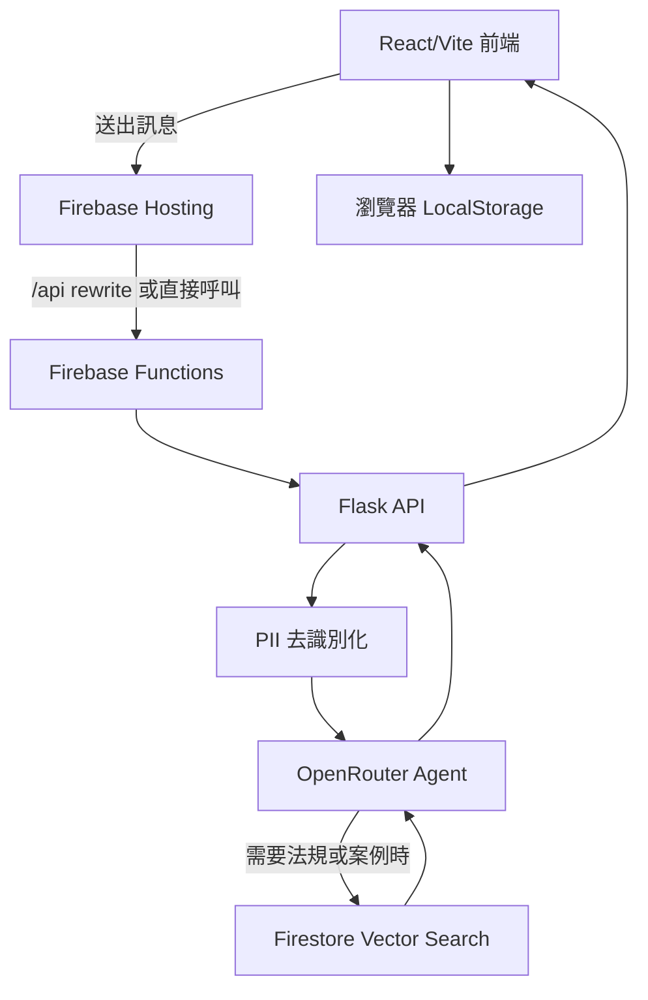

# 性騷擾防治智能 AI 助手

[](https://github.com/TWCkaijin/Anti-Harassment-Bot/actions/workflows/deploy-dev.yml)
[](https://github.com/TWCkaijin/Anti-Harassment-Bot/actions/workflows/deploy-main.yml)

性騷擾防治智能 AI 助手是一個面向台灣使用情境的諮詢與法規引導服務。系統以創傷知情的對話方式回應使用者，並透過 RAG 檢索台灣性騷擾防治相關法規、通報管道、救濟資源與判決資料，協助使用者取得更清楚、可行且具備隱私保護的初步資訊。

> 本專案僅提供資訊整理、同理支持與流程引導，不能取代律師、心理師、醫師、社工或正式申訴與報案程序。

## 部署狀態與網址

| Branch | CD Workflow | 部署環境 | 前端網址 | API URL |
| --- | --- | --- | --- | --- |
| `dev` | [Deploy - Preview](https://github.com/TWCkaijin/Anti-Harassment-Bot/actions/workflows/deploy-dev.yml) | Firebase Hosting Preview Channel | <https://anti-harassment-bot--dev-preview.web.app> | <https://asia-east1-anti-harassment-bot.cloudfunctions.net/api_preview> |
| `main` | [Deploy - Production](https://github.com/TWCkaijin/Anti-Harassment-Bot/actions/workflows/deploy-main.yml) | Firebase Hosting Production | <https://anti-harassment-bot.web.app> | <https://asia-east1-anti-harassment-bot.cloudfunctions.net/api> |

`dev` 分支部署至 Firebase Hosting preview channel，workflow 設定有效期限為 7 天；`main` 分支部署至正式 Firebase Hosting 網址。

## 核心功能

- 創傷知情對話：以溫和、不批判、避免責怪受害者的語氣提供支持與資訊。
- 隱私去識別化：後端在送出模型請求前，會先處理手機、身分證字號、Email、信用卡、IP 等常見個資格式。
- RAG 法規檢索：整合 Firestore Vector Search，檢索法規、救濟資源與性騷擾相關判決資料。
- 本地優先紀錄：對話紀錄保存在使用者瀏覽器 LocalStorage，後端 API 採無狀態設計。
- 前後端分離：前端使用 React + Vite + TypeScript；後端使用 Flask，並透過 Firebase Functions 對外提供 API。

## 系統架構



## 專案結構

```text
.
├── .github/workflows/       # CI 與 Firebase CD workflow
├── backend/                 # Flask API、Agent、RAG 與核心模組
│   ├── app/
│   │   ├── agents/          # OpenRouter agent
│   │   ├── api/             # chat / health API routes
│   │   ├── core/            # config、logger、anonymizer
│   │   └── rag/             # Firestore/default RAG implementation
│   └── scripts/             # Firestore ingestion scripts
├── data/                    # 法規、資源與判決資料
├── frontend/                # React + Vite + TypeScript 前端
├── scripts/                 # 資料轉換工具
├── tests/                   # pytest 測試
├── firebase.json            # Hosting 與 Functions 設定
├── main.py                  # Firebase Functions entrypoint
├── pyproject.toml           # Python dependency / pytest / ruff 設定
└── uv.lock                  # Python lockfile
```

## 本地開發

### 需求

- Python 3.13
- uv
- Node.js 24
- pnpm 9
- Firebase CLI

### 後端

```bash
cp .env.example .env
uv sync
uv run flask --app backend.app.main run --debug
```

後端預設會掛載：

- `GET /api/v1/health`
- `POST /api/v1/chat`
- `GET /v1/health`
- `POST /v1/chat`

### 前端

```bash
cd frontend
pnpm install
pnpm run dev
```

如需指定 API 位置，可在 `frontend/.env` 設定：

```bash
VITE_API_BASE_URL=http://127.0.0.1:5000
```

## 測試與檢查

```bash
uv run ruff check backend/ tests/
uv run ruff format --check backend/ tests/
uv run pytest tests/ -v
```

```bash
cd frontend
pnpm run lint
pnpm run build
```

## CI/CD

- `CI - Lint & Test`：所有 branch push 與 PR 都會執行後端 ruff、pytest、前端 ESLint 與 build。
- `Deploy - Preview (dev)`：push 到 `dev` 時，依變更範圍建置前端與/或部署 preview function。
- `Deploy - Production (main)`：只有變更合併並 push 到 `main` 後，才依變更範圍部署正式 Hosting 與/或 production function。PR 則只執行 `CI - Lint & Test`，不會部署 production。

## Runtime Admin Panel

前端側邊欄提供 `Admin` 入口，可在服務執行期間調整 runtime config。每個部署環境只有一份 Firestore runtime document；模型、RAG、開關與 Prompt Sections 都讀寫同一份文件。Admin API 使用 `ADMIN_API_KEY` 驗證，前端只會預填本機儲存的 token，仍須由後端驗證才能進入面板，且每次寫入都會帶上 token。

Runtime config 預設存放於：

- Collection：`runtime_config`
- dev Document：`app_dev`
- main Document：`app_main`

可調整欄位包含：

- `openrouter_model`
- `temperature`
- `top_p`
- `max_tokens`
- `development_mode`
- `agent_prompt_sections`
- `rag_retrieval_top_k`
- `enable_anonymization`
- `enable_image_upload`
- `rag_collections.law`
- `rag_collections.judgment`
- `rag_collections.remedy`
- `maintenance_message`

Prompt Sections 儲存在同一份 Firestore document 的 `agent_prompt_sections` map。未設定的 section 只會使用程式碼內建的預設內容；不會再讀取 Firebase Remote Config、GitHub Actions Variables 或整份 legacy prompt。

`max_tokens` 設為 `0` 時，後端不會把 token 上限傳給 OpenRouter；其他正整數則會成為單次模型回覆的上限。`development_mode` 僅建議在 `app_dev` 開啟：它會在可重試的模型或 schema 錯誤中，額外回傳伺服器診斷字串給前端，正式環境應維持關閉。

聊天回覆採用 OpenRouter Structured Outputs 的 JSON Schema 契約，必須包含情緒、回覆文字與 2 至 4 個建議回覆。若模型或供應端無法符合契約，前端會顯示「伺服器回傳錯誤，正在重試中」並自動重試兩次；請選用支援 Structured Outputs 的 OpenRouter 模型。

設定優先順序固定為：

1. 該環境的 Firestore runtime document
2. 程式碼內建的本地 fallback

`dev` 的 Admin API 僅寫入 `runtime_config/app_dev`；`main` 僅寫入 `runtime_config/app_main`。

Admin API：

```bash
curl -H "Authorization: Bearer $ADMIN_API_KEY" \
  https://asia-east1-anti-harassment-bot.cloudfunctions.net/api/v1/admin/config
```

建立或補齊 Firestore runtime config 文件：

```bash
curl -X POST -H "Authorization: Bearer $ADMIN_API_KEY" \
  https://asia-east1-anti-harassment-bot.cloudfunctions.net/api/v1/admin/config/seed
```

## 環境變數

請從 `.env.example` 複製 `.env`。部署時只有敏感資訊由 GitHub Actions Secrets 注入；所有可在 Admin Panel 調整的 runtime 欄位都應由 Firestore 管理。`.env` 中的非敏感設定僅供本地開發或 Firestore 欄位尚未建立時的 fallback。

- `OPENROUTER_API_KEY`
- `OPENROUTER_BASE_URL`
- `OPENROUTER_MODEL`
- `OPENROUTER_TEMPERATURE`
- `OPENROUTER_TOP_P`
- `OPENROUTER_MAX_TOKENS`
- `EMBEDDING_PROVIDER`
- `EMBEDDING_MODEL`
- `RAG_COLLECTION_NAME`
- `RAG_JUDGMENT_COLLECTION_NAME`
- `RAG_REMEDY_COLLECTION_NAME`
- `RAG_RETRIEVAL_TOP_K`
- `FIREBASE_ADMIN_CREDENTIAL_PATH`
- `ADMIN_API_KEY`
- `RUNTIME_CONFIG_COLLECTION_NAME`
- `RUNTIME_CONFIG_DOCUMENT_ID`
- `RUNTIME_CONFIG_CACHE_TTL_SECONDS`
- `CORS_ORIGINS`
- `ENABLE_ANONYMIZATION`
- `ENVIRONMENT`

GitHub Actions 部署只需要設定 Secrets：`FIREBASE_TOKEN`、`FIREBASE_SERVICE_ACCOUNT_JSON`、`OPENROUTER_API_KEY` 與 `ADMIN_API_KEY`。不要再設定模型、RAG、匿名化或 Prompt 的 GitHub Actions Variables；它們的雲端來源是 Firestore runtime config。

## 資料匯入

Firestore RAG 資料可透過 `backend/scripts/ingest/` 內的腳本匯入：

```bash
uv run python -m backend.scripts.ingest.documents_to_firestore
uv run python -m backend.scripts.ingest.judgments_to_firestore
uv run python -m backend.scripts.ingest.remedies_to_firestore
```

也可使用整合腳本：

```bash
uv run python -m backend.scripts.ingest.all_to_firestore
```

## 安全聲明

- 請勿將 `.env`、Firebase service account、OpenRouter API key 或任何真實個資提交到 Git。
- 本服務不應被視為法律意見、醫療建議或心理諮商。
- 若使用者處於立即危險，請優先聯絡 `110`、`113`、`1955` 或所在地正式求助管道。
