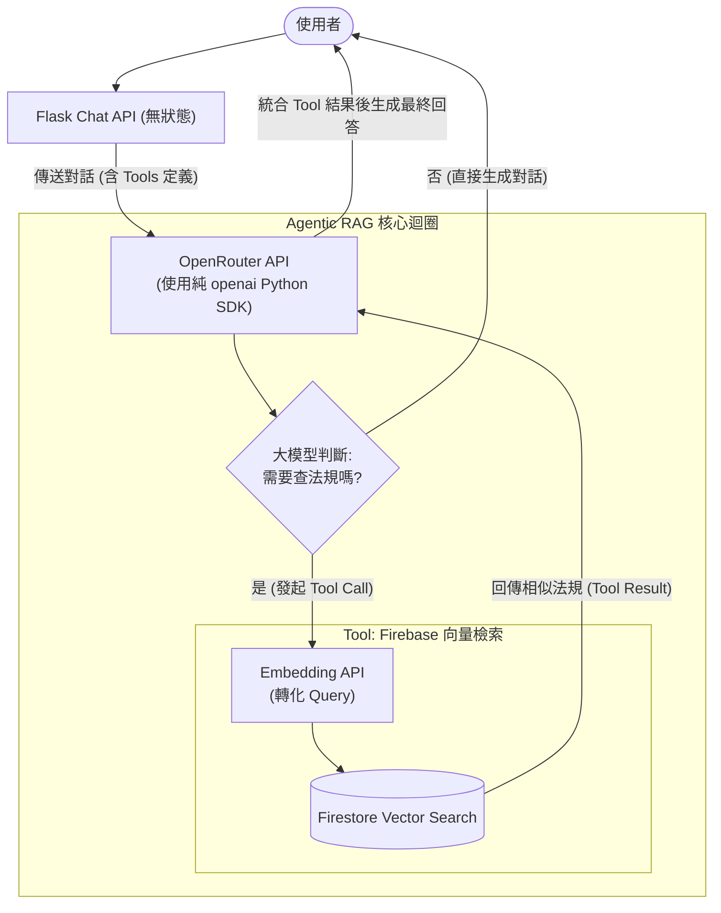

# 替換 RAG 檢索與生成模型綜合執行計畫 (Cloud-API 先行版)

本計畫旨在將當前基於關鍵字比對的 `DefaultRAG` 升級為真實的向量檢索，並捨棄繁重的本地微調與自建模型部署。我們將全面擁抱「雲端 API 先行 (Cloud-API First)」策略，利用 **OpenRouter** 作為模型推論閘道，並以 **Firebase Firestore 向量資料庫** 作為 RAG 的核心。

## 系統架構流程圖 (Agentic RAG 架構)

---

## User Review Required

> [!WARNING]
> **OpenRouter 上的 Embedding 模型支援**
> OpenRouter 主要是做 LLM (Chat Completions) 的路由，雖然它們也有代理一些 Embedding API，但可能不包含您原本指定的 `multilingual-e5` 模型（通常是代理 OpenAI `text-embedding-3` 或 Cohere 的 Embedding 模型）。
> **確認事項**：請確認您是否堅持使用 `multilingual-e5`？如果是的話，可能需要改用 HuggingFace Inference API 或其他專門提供 E5 的端點來取代 OpenRouter 的 Embedding 呼叫。

> [!CAUTION]
> **Firebase Firestore Vector Search 限制**
> Firebase 已經在 Firestore 支援原生的向量搜尋 (`vector` data type 與 `find_nearest` query)。不過這項功能需要您的 Firebase 專案升級至 **Blaze (Pay as you go)** 計畫才能完整發揮效能與建立 Vector Index。
> **確認事項**：請確認目前的 Firebase 專案環境是否允許我們建立 Vector Index。

---

## 🎯 確立之架構決策 (Resolved Architectural Decisions)

1. **全面放棄本地微調與託管**：不再維護本地的 E5、TAIDE 或 ShieldGemma。這能將後端基礎設施的複雜度降到最低，並將精力集中在業務邏輯與 Prompt Engineering。
2. **捨棄 Google ADK，擁抱純 OpenAI SDK**：
   - 完全移除 `google.adk` 與其狀態管理。
   - 在 Flask 中直接使用官方的 `openai` 套件連接 `https://openrouter.ai/api/v1`。這保證了 100% 相容所有開源模型的最新功能 (如 Function Calling 與 JSON Mode)。
3. **實作 Agentic RAG (代理式檢索增強)**：
   - 不再每一句話都無腦去 Firebase 撈資料。我們會將「Firestore 向量搜尋」包裝成一個 OpenAI 格式的 `Tool (Function)`。
   - 交由 OpenRouter 上的 Qwen/Gemma 模型自行判斷使用者的語境是否需要查閱法律，大幅提升對話的自然度與檢索精準度。
4. **Firebase Firestore 向量檢索**：
   - 將所有法規文本與對應的 Embedding 向量存入 Firestore 的專屬 Collection 中（例如 `rag_documents`）。
   - 享受 Firebase 原生的高可用性與無伺服器 (Serverless) 擴展能力。

---

## 執行階段計畫 (Execution Phases)

### Phase 1: 建立 Firebase 向量資料庫基礎 (`backend/app/rag/`)
1. 修改 Firebase 初始化邏輯，確保支援最新版的 Firestore SDK。
2. 撰寫一隻一次性的**資料匯入腳本 (Seeder)**：
   - 讀取預設的性騷擾防治法規資料。
   - 呼叫 Embedding API 取得各段落的向量。
   - 將文本與向量寫入 Firestore 的 `rag_documents` Collection，並在 Firebase Console 建立對應的 Vector Index。
3. 實作 `retrieve_from_firestore` 輔助函式，使用 `find_nearest` 語法根據 Query 向量找回最相似的文本。

### Phase 2: 實作純 OpenAI SDK 的 Agentic RAG (`backend/app/agents/`)
1. **清理 ADK 依賴**：刪除 `backend/app/agents/base.py` 中與 `InMemorySessionService` 相關的邏輯。
2. **定義 RAG 工具**：撰寫 JSON Schema 格式的 `tools` 定義，描述「性騷擾法規與求助管道檢索工具」。
3. **實作 Tool Calling 迴圈**：
   - 使用 `AsyncOpenAI` 發送請求給 OpenRouter。
   - 判斷回傳結果是否包含 `tool_calls`。若有，則攔截請求 -> 執行 `retrieve_from_firestore` -> 將結果作為 `tool_role` 的訊息塞回對話歷史 -> 再次呼叫 OpenRouter 取得最終回答。

### Phase 3: Flask API 重構 (`backend/app/api/chat.py`)
1. 將 API 端點重構為無狀態 (Stateless)。
2. 直接接收前端傳來的 History 陣列，轉換格式後丟進 Phase 2 實作的 Agentic RAG 核心函式。
3. 加入對 OpenRouter API Timeout 與網路錯誤的處理機制。
